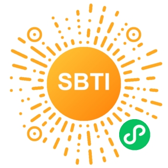

# SBTI 人格测试

一个基于 Vue 3 的娱乐性人格测试 Web 应用，包含 15 个评估维度、30 道测试题和 26 种人格类型。

**在线体验：** [https://sbti.solaboom.cn/](https://sbti.solaboom.cn/)

**微信小程序：**



## 技术栈

- **Vue 3** — Composition API + `<script setup>`
- **Vue Router 4** — 路由管理
- **Vite 5** — 构建工具

## 环境要求

- Node.js >= 18（项目已配置 `.nvmrc`，可直接 `nvm use`）
- npm / yarn / pnpm 任选

## 快速开始

```bash
# 切换 Node 版本（如使用 nvm）
nvm use

# 安装依赖
npm install

# 启动开发服务器
npm run dev

# 生产构建
npm run build

# 预览构建产物
npm run preview
```

## 项目结构

```
sbti-vue/
├── public/image/              # 人格类型结果图片
├── src/
│   ├── assets/main.css        # 全局样式与 CSS 变量
│   ├── components/
│   │   ├── ProgressBar.vue    # 答题进度条
│   │   └── QuestionCard.vue   # 题目卡片
│   ├── composables/
│   │   └── useTest.js         # 核心测试逻辑（出题、计分、匹配）
│   ├── data/
│   │   ├── dimensions.js      # 15 维度定义与解读文案
│   │   ├── questions.js       # 30 道常规题 + 2 道特殊题
│   │   └── types.js           # 26 种人格类型与匹配模式
│   ├── router/index.js        # 路由配置
│   ├── store.js               # 全局状态单例
│   ├── views/
│   │   ├── IntroView.vue      # 首页
│   │   ├── TestView.vue       # 答题页
│   │   └── ResultView.vue     # 结果页
│   ├── App.vue                # 根组件
│   └── main.js                # 入口
├── index.html
├── package.json
└── vite.config.js
```

## 测试逻辑简述

1. 30 道题随机打乱，中间随机插入 1 道特殊题（可触发隐藏人格）
2. 每题 3 个选项，对应 1/2/3 分，每个维度 2 道题，满分 6 分
3. 维度得分映射为等级：≤3 → L，4 → M，≥5 → H
4. 将用户的 15 维度等级向量与 25 种标准人格模式进行距离匹配
5. 最高匹配度 < 60% 时触发兜底人格（HHHH）；特殊题触发酒鬼人格（DRUNK）

## 部署

构建产物在 `dist/` 目录，可部署至任意静态托管平台：

```bash
npm run build
```

> 如使用 History 模式路由，部署时需配置服务端将所有路径回退到 `index.html`。

## 联系

如有开发需求，请前往 CSDN 搜索 **Dark_programmer** 进行联系。

## 免责声明

- 本项目仅供娱乐，测试结果不具备任何心理学、医学或科学依据。
- 请勿将测试结果用于招聘、诊断、相亲、面试等正式场合。
- 本项目不对因使用测试结果而产生的任何后果承担责任。
- 部分人格描述文案带有夸张与戏谑成分，如有冒犯，纯属娱乐，敬请谅解。
- 本项目禁止用于任何商业盈利用途。
